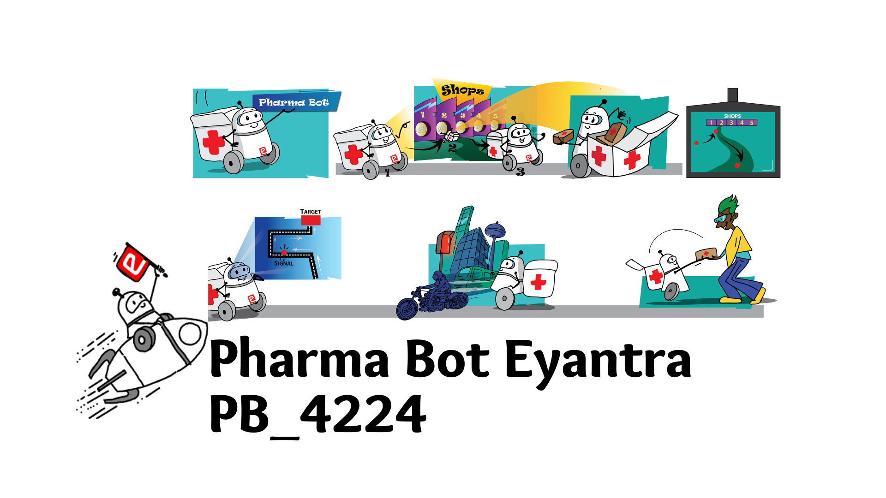

## Hey, this is us 👋

Yes, we are building Eyantra_PB_4224 on GitHub. In fact, we’ve been doing this since **sept 15 2022**. That's when we made our first commit. Since then we pushed **many**, opened **Many Issues**, submitted roughly **# solutions**. But that's just us. We are proud  to be part of Eyantra and Robots :robot: across the world 🗺️.
### 🍿 An interconnected community

Made with :heart:
🙇‍♂️🎤⬇️

